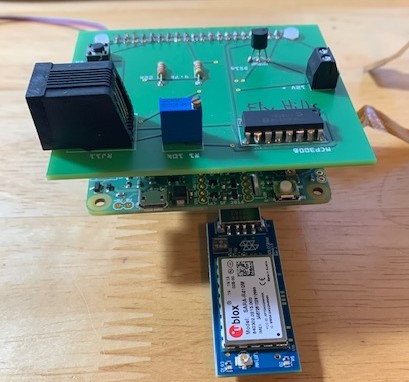
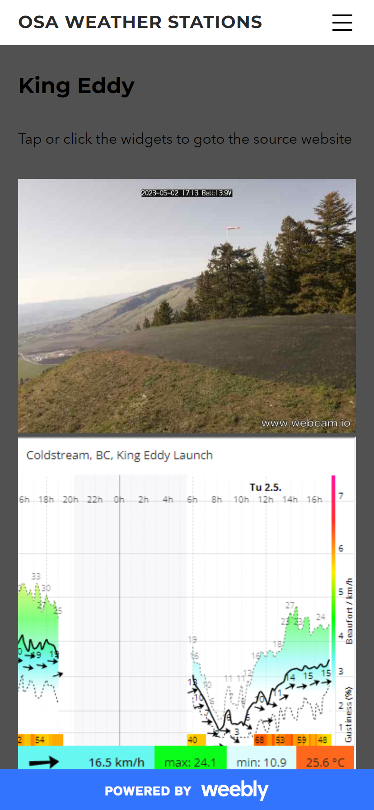

# Pi Weather Station

This is a hardware/software project for an off grid solar powered weather station with webcam that posts to the internet via a cellular modem. Wind speed, wind direction and temperature are recorded. The project was completed in 2017/2018. As of December 2022 there is still a unit in service at a paragliding launch in Vernon, BC Canada.

## Hardware

A raspberry pi-zero is used in combination with a sleepy-pi board (arduino + real time clock) and a custom printed circuit board for analog to digital conversion for the anemometer and battery voltage. A Hologram Nova LTE-M1 cellular modem is used for internet connection. A 25W solar panel with solar controller is used to charge an 8Ah 12V lead acid battery. The anemometer is an off the shelf Davis 6410

The custom printed circuit board design file contains full electrical schematics and is located in the [fritzing folder](./fritzing/) Fritzing software is required to open the file and can be downloaded from their website in the [links](#links) section.

PCB features:

- An RJ11 connector for the davis 6410 anemometer
- MCP3008 analog to digital converter
- 12V voltage divider circuit with 20K trim pot for calibration
- DS18B20 digital temperature sensor

A full parts list is located in the [parts_list folder](./parts_list/)

  
  
  
  

 

## Software

This was my first programing project, I had not touched python prior to the project and didn't understand how to properly structure code. The code works well but it's not pretty. I would like to revisit this project down the road and create a revised design based on everything I've learned to date.

### [Python files](./python_files/)

- [voltage_calibration.py](./python_files/voltage_calibration.py) - used to calibrate the 12V voltage divider circuit which is used to display battery voltage on the webcam and shutdown the pi in case of low voltage.

- [weather_read.py](./python_files/weather_read.py) - every 15 min collects wind speed (min, peak, avg.), direction, temperature and battery voltage, sends data to windguru API and uploads webcam photo to webcam.io.

### [Arduino Files](./sleepy-pi-arduino/)

- [sleepypi.ino](./sleepy-pi-arduino/sleepypi.ino) - config file for the arduino/RTC which turns the raspberry pi on in the morning and off at night to conserve battery. It also keeps the raspberry pi powered down over the winter months to ensure the battery stays charged and doesn't freeze. The paragliding sites are not flown in the winter so there was no need to keep the stations online in the winter months.

### [Crontab](./crontab/)

- [crontab.txt](./crontab/crontab.txt) -this runs the weather_read.py script every 15 minutes while the raspberry pi is booted. It also clears the logs once a month to keep the SD card from getting full.

### [Hologram chat script](./chatscript/)

- This folder contains the location of the cellular modem chat script on the raspberry pi as well as the [chat script](./chatscript/default-script.txt) itself. The chat script needs to be modified based on the IP for your cellular provider.

## Website

The website is a very simple design on weebly which combines responsive widgets from windguru and webcam.io to make the data view well on mobile and desktop devices.

  
    

 

## Credits

[BC Robotics](https://bc-robotics.com/tutorials/raspberry-pi-weather-station-part-2/) has a great tutorial that i used to help figure out how to read the digital temperature sensor and anemometer data with the raspberry pi and a mcp3008 A/D converter

## Links

[OSA Weather](https://osa-weather.weebly.com) - Weather station website. Note that the stations are offline until the end of March.

[Windguru](https://www.windguru.cz) - Hosting for the weather station data. They have a fairly straightforward API using an http GET request.

[webcam.io](https://webcam.io) - Hosting for the webcam images via FTP.

[Fritzing](https://www.fritzing.org) - PCB design software

[Spellfoundry](https://spellfoundry.com/) - sleepy-pi RTC board.

[Hologram](https://www.hologram.io/) - Hologram Nova cellular modem
